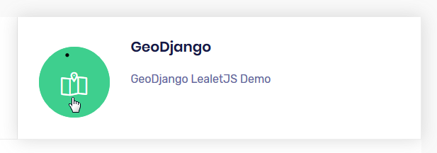
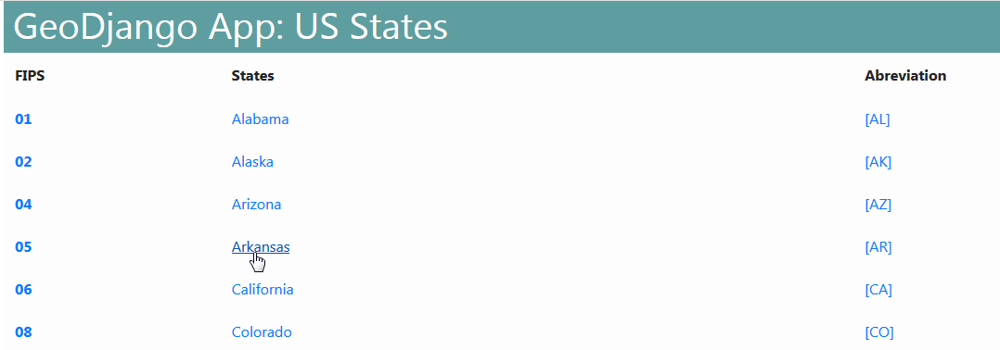
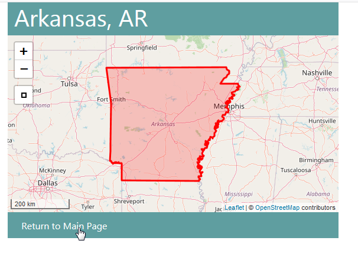

.. _jri-label:
.. This is a comment. Note how any initial comments are moved by
   transforms to after the document title, subtitle, and docinfo.

.. demo.rst from: http://docutils.sourceforge.net/docs/user/rst/demo.txt

.. |EXAMPLE| image:: static/yi_jing_01_chien.jpg
   :width: 1em

**********************
GeoDjango
**********************

.. contents:: Table of Contents

Access
=================

A basic GeoDjango app usign PostGIS is created upon installation.

It can be access via the GeoDjango tab on the home page:

It can also be access directly via url at::

   http://domain.com:8000/states/
   
   

Usage
=================

Once accessed using above, click the link for a state as show below:

The detail for the state will be displayed as below:

   
Click the Return to Main Page to return to the app homepage.

Django Admin
==============

The Django Admin Panel is located at::

   	http://domain.com:8000/admin
   
If accessing via IP, substitute the IP for 'domain.com' above.
   
The Django admin password is saved on disk at::

	/root/auth.txt
   

Structure
=============

The GeoDjango app is located under /opt/geodjango.

It has the following structure:

.. code-block:: bash
   :linenos:

	/opt/geodjango
	└── world
    	├── manage.py
    	├── media
    	├── states
    	│   ├── __init__.py
    	│   ├── __pycache__
    	│   │   ├── __init__.cpython-36.pyc
    	│   │   ├── admin.cpython-36.pyc
    	│   │   ├── load.cpython-36.pyc
    	│   │   ├── models.cpython-36.pyc
    	│   │   ├── urls.cpython-36.pyc
    	│   │   └── views.cpython-36.pyc
    	│   ├── admin.py
    	│   ├── apps.py
    	│   ├── data
    	│   │   ├── states.dbf
    	│   │   ├── states.prj
    	│   │   ├── states.sbn
    	│   │   ├── states.sbx
    	│   │   ├── states.shp
    	│   │   ├── states.shp.xml
    	│   │   └── states.shx
    	│   ├── migrations
    	│   │   ├── 0001_initial.py
    	│   │   ├── __init__.py
    	│   │   └── __pycache__
    	│   │       ├── 0001_initial.cpython-36.pyc
    	│   │       └── __init__.cpython-36.pyc
    	│   ├── models.py
    	│   ├── support
    	│   │   ├── geodjango.apache
    	│   │   └── load.py
    	│   ├── templates
    	│   │   └── states
    	│   │       ├── state-detail.html
    	│   │       └── states-index.html
    	│   ├── tests.py
    	│   ├── urls.py
    	│   └── views.py
    	├── static
    	│   ├── admin
    	│   │   ├── css
    	│   │   │   ├── autocomplete.css
    	│   │   │   ├── base.css
    	│   │   │   ├── changelists.css
    	│   │   │   ├── dashboard.css
    	│   │   │   ├── fonts.css
    	│   │   │   ├── forms.css
    	│   │   │   ├── login.css
    	│   │   │   ├── responsive.css
    	│   │   │   ├── responsive_rtl.css
    	│   │   │   ├── rtl.css
    	│   │   │   ├── vendor
    	│   │   │   │   └── select2
    	│   │   │   │       ├── LICENSE-SELECT2.md
   	│   │   │   │       ├── select2.css
    	│   │   │   │       └── select2.min.css
    	│   │   │   └── widgets.css
    	│   │   ├── fonts
        │   │   ├── img
    	│   │   │   ├── LICENSE
    	│   │   │   ├── README.txt
    	│   │   │   ├── calendar-icons.svg
    	│   │   │   ├── gis
    	│   │   │   │   ├── move_vertex_off.svg
    	│   │   │   │   └── move_vertex_on.svg
   	    │   │   └── js
    	│   │       ├── SelectBox.js
    	│   │       ├── SelectFilter2.js
    	│   │       ├── actions.js
    	│   │       ├── actions.min.js
    	│   │       ├── admin
    	│   │       │   ├── DateTimeShortcuts.js
    	│   │       │   └── RelatedObjectLookups.js
    	│   │       ├── autocomplete.js
    	│   │       ├── calendar.js
    	│   │       ├── cancel.js
    	│   │       ├── change_form.js
    	│   │       ├── collapse.js
    	│   │       ├── collapse.min.js
    	│   │       ├── core.js
    	│   │       ├── inlines.js
    	│   │       ├── inlines.min.js
    	│   │       ├── jquery.init.js
    	│   │       ├── popup_response.js
    	│   │       ├── prepopulate.js
    	│   │       ├── prepopulate.min.js
    	│   │       ├── prepopulate_init.js
    	│   │       ├── urlify.js
    	│   │       └── vendor
    	│   │           ├── jquery
    	│   │           │   ├── LICENSE.txt
    	│   │           │   ├── jquery.js
    	│   │           │   └── jquery.min.js
    	│   │           ├── select2
    	│   │           │   ├── LICENSE.md
    	│   │           │   ├── i18n
    
    	│   │           │   ├── select2.full.js
    	│   │           │   └── select2.full.min.js
    	│   │           └── xregexp
    	│   │               ├── LICENSE.txt
    	│   │               ├── xregexp.js
    	│   │               └── xregexp.min.js
    	│   ├── gis
    	│   │   ├── css
    	│   │   │   └── ol3.css
    	│   │   ├── img
    	│   │   │   ├── draw_line_off.svg
    	│   │   │   ├── draw_line_on.svg
    	│   │   │   ├── draw_point_off.svg
    	│   │   │   ├── draw_point_on.svg
   	│   │   │   ├── draw_polygon_off.svg
    	│   │   │   └── draw_polygon_on.svg
    	│   │   └── js
    	│   │       └── OLMapWidget.js
    	│   └── leaflet
    	│       ├── Control.MiniMap.css
    	│       ├── Control.MiniMap.js
    	│       ├── draw
    	│       │   ├── images
    	│       │   │   ├── layers-2x.png
    	│       │   │   ├── layers.png
    	│       │   │   ├── marker-icon-2x.png
    	│       │   │   ├── marker-icon.png
    	│       │   │   ├── marker-shadow.png
    	│       │   │   ├── spritesheet-2x.png
    	│       │   │   ├── spritesheet.png
    	│       │   │   └── spritesheet.svg
    	│       │   ├── leaflet.draw-src.css
    	│       │   ├── leaflet.draw-src.js
    	│       │   ├── leaflet.draw.css
    	│       │   └── leaflet.draw.js
    	│       ├── eventlistener.ie6-7.js
    	│       ├── eventlistener.ie8.js
    	│       ├── images
    	│       │   ├── layers-2x.png
    	│       │   ├── layers.png
    	│       │   ├── marker-icon-2x.png
    	│       │   ├── marker-icon.png
    	│       │   ├── marker-icon@2x.png
    	│       │   ├── marker-shadow.png
    	│       │   ├── reset-view.png
    	│       │   ├── toggle.png
    	│       │   ├── zoom-in.png
    	│       │   └── zoom-out.png
    	│       ├── leaflet-src.js
    	│       ├── leaflet.css
    	│       ├── leaflet.extras.js
    	│       ├── leaflet.forms.js
    	│       ├── leaflet.ie.css
    	│       ├── leaflet.js
    	│       ├── proj4js.js
    	│       └── proj4leaflet.js
    	└── world
        	├── __pycache__
        	│   ├── settings.cpython-36.pyc
        	│   └── urls.cpython-36.pyc
        	├── asgi.py
        	├── settings.py
        	├── settings.py.save
        	├── urls.py
        	└── wsgi.py

Documentation
==============

https://docs.djangoproject.com/en/3.0/ref/contrib/gis/

   
