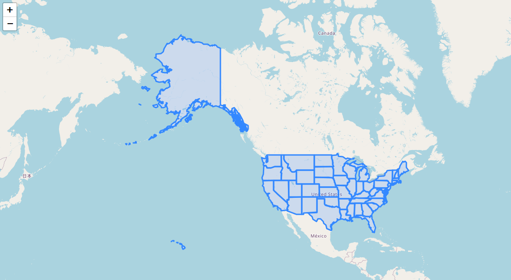
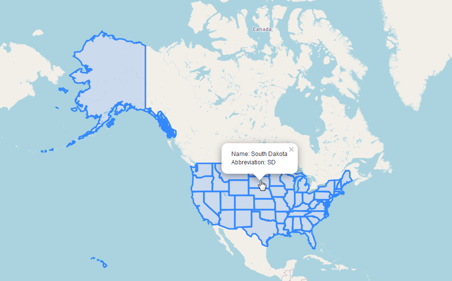

.. _jri-label:
.. This is a comment. Note how any initial comments are moved by
   transforms to after the document title, subtitle, and docinfo.

.. demo.rst from: http://docutils.sourceforge.net/docs/user/rst/demo.txt

.. |EXAMPLE| image:: static/yi_jing_01_chien.jpg
   :width: 1em

**********************
Leaflet GeoJson
**********************

.. contents:: Table of Contents

Access
=================

A web application employing LeafletJS and GeoJson is enabled upon installation.

It can be access via the Leaflet tab on the home page:

.. image:: _static/leaflet-tab.png

It can also be access directly via url at::

   http://domain.com/LeafletJSDemo.html
   
   

Usage
=================

Once accessed using above, the app will appear as shown below:

Click on the US layer to view the getFeature info for the State.

The data will be displayed as below:

   

Structure
=============

The app is located at::

	/vaw/www/html/LeafletJSDemo.html
		
On installation, data from PostgreSQL is exported to GeoJson format and saved to::

	/var/www/html/states.json
	

Content
=========

The content of the html page is displayed below.

.. code-block:: console
   :linenos:

	<!doctype html>
	<html>
	<head>
  	

	<link rel="stylesheet" href="https://unpkg.com/leaflet@1.1.0/dist/leaflet.css"
   	integrity="sha512-wcw6ts8Anuw10Mzh9Ytw4pylW8+NAD4ch3lqm9lzAsTxg0GFeJgoAtxuCLREZSC5lUXdVyo/7yfsqFjQ4S+aKw=="
   	crossorigin=""/>

    	
  	</head> 
  
	
	</head>
	<body>
  	

  	
	</body>
	</html>

Documentation
==============
https://leafletjs.com/

https://leafletjs.com/examples/geojson/
   
