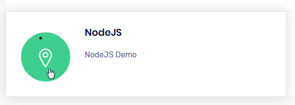
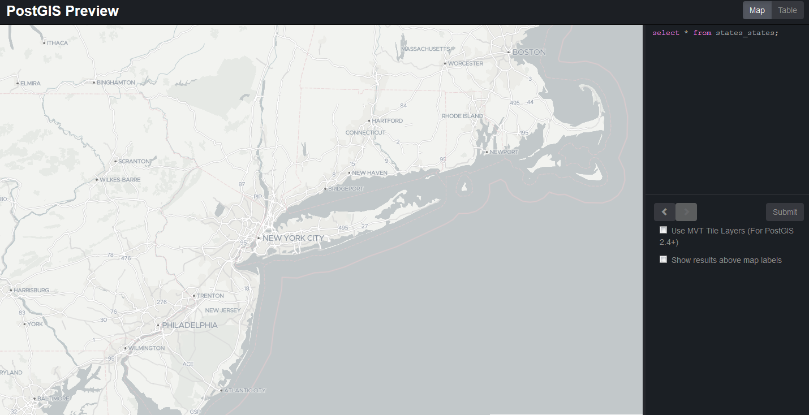
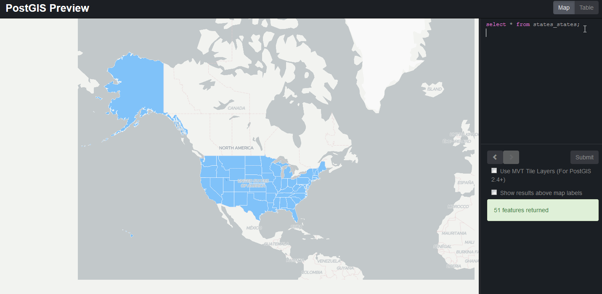
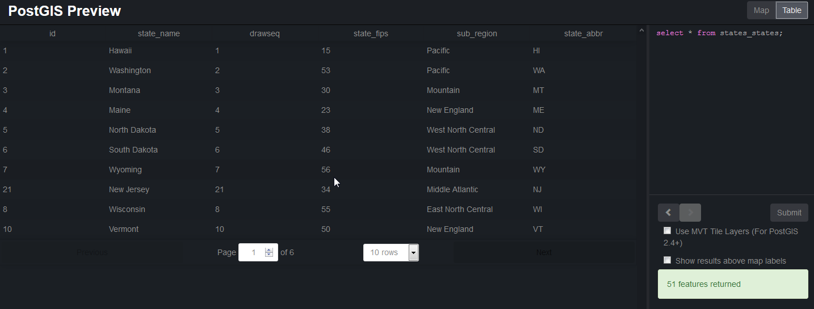

.. _jri-label:
.. This is a comment. Note how any initial comments are moved by
   transforms to after the document title, subtitle, and docinfo.

.. demo.rst from: http://docutils.sourceforge.net/docs/user/rst/demo.txt

.. |EXAMPLE| image:: static/yi_jing_01_chien.jpg
   :width: 1em

**********************
NodeJS
**********************

.. contents:: Table of Contents

Access
=================

A web application, PostGIS Preview, employing NodeJS is enabled upon installation.

The application is an Open Source application created by:

https://github.com/NYCPlanning/labs-postgis-preview

It can be access via the NodeJS tab on the home page:

It can also be access directly via url at::

  http://domain.com:4000
   
   

Usage
=================

Once accessed using above, the app will appear as shown below:

Enter a query and click submit.  For example::

	select * from states_states;
	
The layer will now appear as shown below:

To view the underlying data, click the data tab as shown below.

   

Structure
=============

The app is located at::

	/opt/pg_preview

Documentation
==============
https://github.com/NYCPlanning/labs-postgis-preview

   
