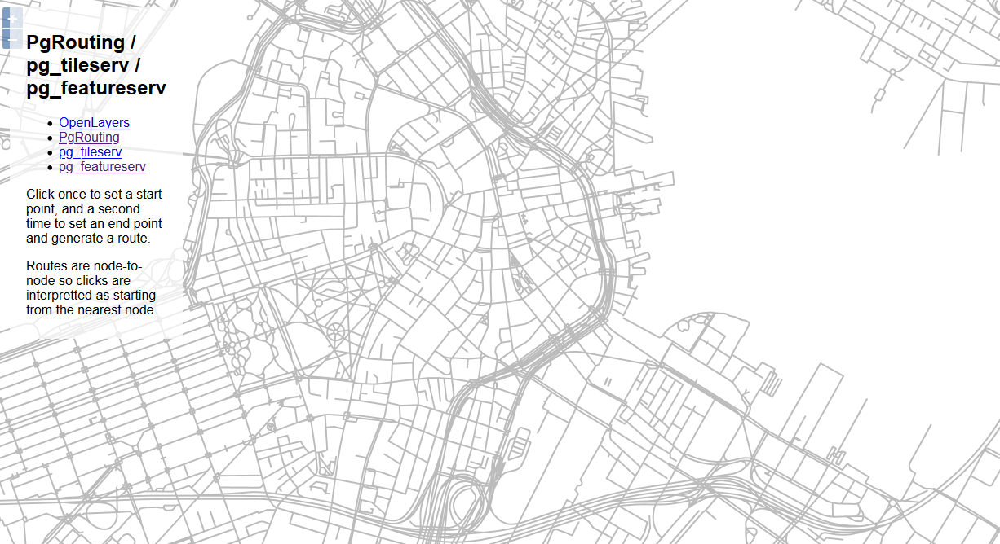
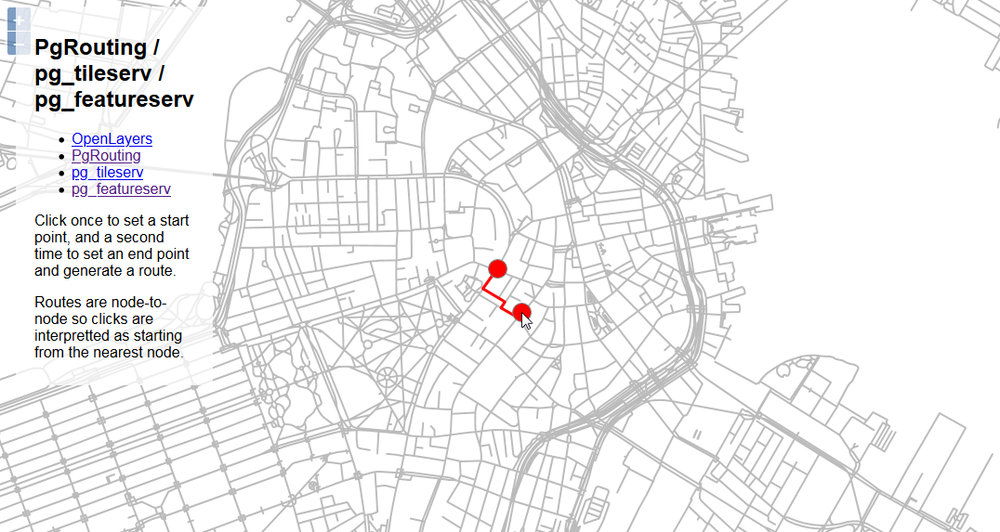

.. _jri-label:
.. This is a comment. Note how any initial comments are moved by
   transforms to after the document title, subtitle, and docinfo.

.. demo.rst from: http://docutils.sourceforge.net/docs/user/rst/demo.txt

.. |EXAMPLE| image:: static/yi_jing_01_chien.jpg
   :width: 1em

**********************
pg_tileserv
**********************

.. contents:: Table of Contents

Access
=================

A web application employing pg_tileserv, PgRouting, and pg_featurserv is enabled upon installation.

This app is included in the CrunchyData examples and is simply configured for use.

It can be access via the pg_tileserv tab on the home page:

.. image:: _static/pgtile-tabs.png

It can also be access directly via url at::

   http://domain.com/openlayers-pgrouting.html
   
   

Usage
=================

Once accessed using above, the app will appear as shown below:

Click anywhere to select a start location, then click elswhere for an end location.

The route will be displayed as below:

   

Structure
=============

The app is located at::

	/vaw/www/html/pgrouting-openlayers.html
	
On installation, the pg_tileserv and pg_featureserv urls are set in the html document::

	...
	var vectorUrl = "http://206.189.186.146:7800/public.ways/{z}/{x}/{y}.pbf";
	...
    	var url = "http://206.189.186.146:9000/functions/boston_find_route/items.json";
	...

Documentation
==============
https://openlayers.org

https://pgrouting.org/

https://github.com/crunchydata/pg_tileserv

https://github.com/crunchydata/pg_featureserv 

   
