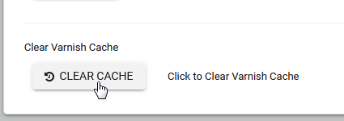
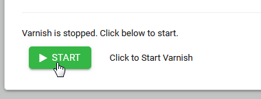

.. _jri-label:
.. This is a comment. Note how any initial comments are moved by
   transforms to after the document title, subtitle, and docinfo.

.. demo.rst from: http://docutils.sourceforge.net/docs/user/rst/demo.txt

.. |EXAMPLE| image:: static/yi_jing_01_chien.jpg
   :width: 1em

**********************
Varnish
**********************

.. contents:: Table of Contents

About
=================

Varnish Cache is an HTTP accelerator.

By caching output, you reduce calls the the database and speed site performance.

   

Usage
=================

The most common function is clearing Cache after changes are made.

To clear cache, click the Clear Cache button as show below:

If Varnished has stopped for any reason, a Start button will appear as below:

You can also stop/start/restart Varnish via command line::

  service varnish stop | stop | restart | status
   

Configuration
=============

The main varnish configuration file, default.vcl is located at::

	/etc/varnish/default.vcl
		
The content will contain a backend default similar to below::

			backend default {
    			.host = "127.0.0.1";
    			.port = "8080";
			}
		
Note the backend port, which is the port that Apache is on.

Similarly, Varnish itself is run on port 80.  This is defined in the varnish.service file located at::

/etc/systemd/system/varnish.service.d/varnish.conf

The contents of varnish.conf are as below::

 [Service]
 ExecStart=
 ExecStart=/usr/sbin/varnishd -j unix,user=vcache -F -a :80 -a localhost:8443,PROXY -p feature=+http2 -f /etc/varnish/default.vcl -S /etc/varnish/secret -s malloc,1g
		
Note that Varnish is accepting requests on 80 and proxy HTTPS requests to 8443

HTTPS
=========

Because Varnish does not work with HTTPS, we use Hitch to handle all HTTPS requests.

Documentation
==============
https://varnish-cache.org
   
