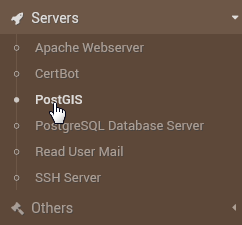

.. _wizard-label:

************
Wizard
************

If (and only if) if you have elected to install the PostGIS Builder components via the Webmin Module, you can use the Wizard to to configure the components.

Go to Servers > PostGIS:

The main Wizard screen will a link for completing each step.

The steps are self-explanatory.  Simply click through the Wizard, selecting the components you wish to install.
